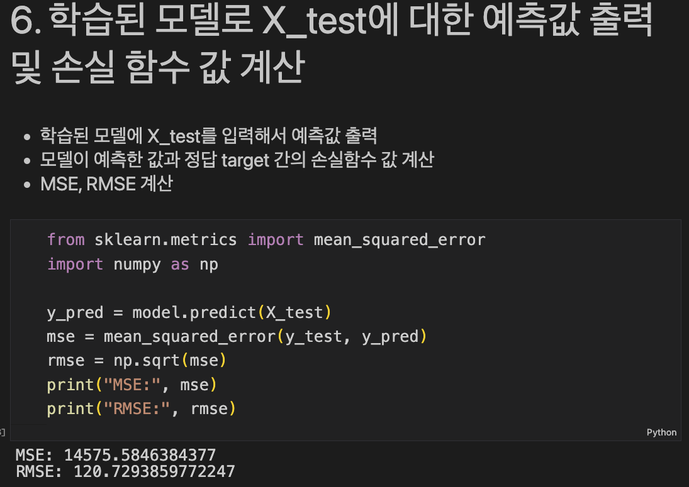
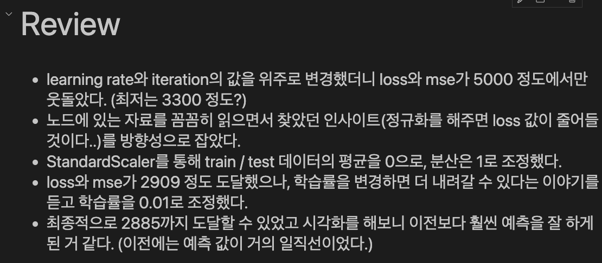
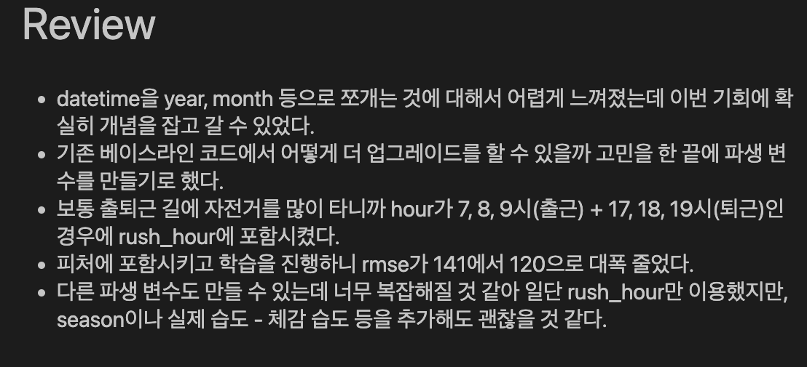
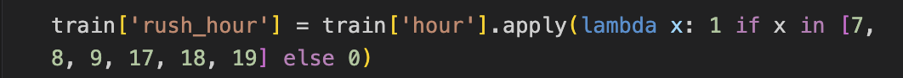

# AIFFEL Campus Online Code Peer Review Templete
- 코더 : 임정민
- 리뷰어 : 박진용


# PRT(Peer Review Template)
- [X]  **1. 주어진 문제를 해결하는 완성된 코드가 제출되었나요?**
    - 문제에서 요구하는 최종 결과물이 첨부되었는지 확인
        - 중요! 해당 조건을 만족하는 부분을 캡쳐해 근거로 첨부
        
        
        


- [X]  **2. 전체 코드에서 가장 핵심적이거나 가장 복잡하고 이해하기 어려운 부분에 작성된 
주석 또는 doc string을 보고 해당 코드가 잘 이해되었나요?**
    셀을 진행하기 전 간단한 설명을 통해 새로운 코드의 이해를 도움
    코드를 추가한 근거를 기술함
    
    - 해당 코드 블럭을 왜 핵심적이라고 생각하는지 확인
    - 해당 코드 블럭에 doc string/annotation이 달려 있는지 확인
    - 해당 코드의 기능, 존재 이유, 작동 원리 등을 기술했는지 확인
    - 주석을 보고 코드 이해가 잘 되었는지 확인
        - 중요! 잘 작성되었다고 생각되는 부분을 캡쳐해 근거로 첨부


- [X]  **3. 에러가 난 부분을 디버깅하여 문제를 해결한 기록을 남겼거나
새로운 시도 또는 추가 실험을 수행해봤나요?**
        
    
    - 새로운 시도에 대한 기록이 잘 남아있음


- [X]  **4. 회고를 잘 작성했나요?**

    
    
    - 주어진 문제를 해결하는 완성된 코드 내지 프로젝트 결과물에 대해
    배운점과 아쉬운점, 느낀점 등이 잘 기록되어 있음
    - 전체 코드 실행 플로우를 그래프로 그려서 이해를 돕고 있는지 확인
        아쉽게 실행 플로우 그래프를 작성하지는 않음 
      
        
- [X]  **5. 코드가 간결하고 효율적인가요?**
    간결화 함수인 람다를 잘 활용하여 짧고 알찬 코드를 작성함
    
    
    - 파이썬 스타일 가이드 (PEP8) 를 준수하였는지 확인
    - 코드 중복을 최소화하고 범용적으로 사용할 수 있도록 함수화/모듈화했는지 확인
        


# 회고(참고 링크 및 코드 개선)
```
시간대를 이용해 새로운 피쳐를 만든다는 발상은 비슷했지만 
이를 어떻게 나눌지에 대한 생각은 모두 다른듯 하다.
누가 딱히 정답이라고는 할 수 없지만 본인은 3개의 구간으로 나눈 반면
코더는 이용이 몰리는 출퇴근 시간을 기준으로 새로운 피처를 생성해냈고 
이는 확실히 3개의 구간으로 나눈것보다 약간 높은 성능을 발휘했다.
```


